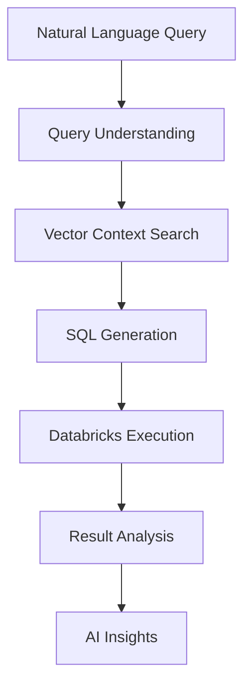
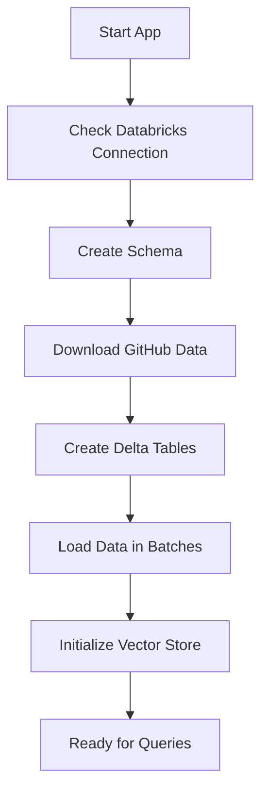

# GenAI Sales Analyst
*(Powered by Amazon Bedrock and Databricks)*

A fully automated Streamlit application that transforms natural language questions into SQL queries and provides intelligent analysis of sales data using Amazon Bedrock, LangGraph, and FAISS vector search with complete Databricks automation.


## 🚀 Features

- **Complete Databricks Automation**: Automatically creates workspace, serverless warehouse, and schema
- **Natural Language to SQL**: Ask questions in plain English, get SQL queries automatically
- **Intelligent Analysis**: AI-powered insights and explanations of your data
- **Vector Search**: FAISS-powered semantic search for relevant database context
- **LangGraph Workflow**: Structured AI workflow with error handling and recovery
- **GitHub Data Integration**: Automatically downloads complete Northwind dataset from GitHub
- **Zero Configuration**: Just add AWS credentials and run!

## 🏗️ Architecture & Data Flow

```
┌─────────────────┐    ┌──────────────────┐    ┌─────────────────┐
│   Streamlit UI  │───▶│  Amazon Bedrock  │───▶│   Databricks    │
└─────────────────┘    └──────────────────┘    └─────────────────┘
         │                       │                       │
         ▼                       ▼                       ▼
┌─────────────────┐    ┌──────────────────┐    ┌─────────────────┐
│ FAISS Vector   │    │   LangGraph      │    │ Serverless SQL  │
│ Store           │    │   Workflow       │    │ Warehouse       │
└─────────────────┘    └──────────────────┘    └─────────────────┘
```

### Data Flow Process:
1. **User Query** → Natural language question input
2. **Query Understanding** → AI analyzes and classifies the query
3. **Context Retrieval** → Vector search finds relevant schema information
4. **SQL Generation** → Bedrock generates optimized Databricks SQL
5. **Query Execution** → SQL runs on Databricks serverless warehouse
6. **Result Analysis** → AI provides insights and explanations
7. **Response Display** → Results shown in Streamlit interface

## 📋 Prerequisites

- **AWS Account** with appropriate permissions (Bedrock)
- **Python 3.8+** installed
- **AWS CLI** configured (`aws configure`)
- **Git** (optional, for cloning)

## ⚡ Quick Start (10 Minutes!)

### 1. Clone or Download

```bash
git clone https://github.com/AWS-Samples-GenAI-FSI/Sales-Analyst-Bedrock-Databricks-.git
cd Sales-Analyst-Bedrock-Databricks-
```

### 2. Install Dependencies
```bash
pip install -r requirements.txt
```

### 3. Configure AWS Credentials
```bash
cp .env.example .env
# Edit .env with your AWS credentials
```

**Required Environment Variables:**
```bash
# AWS Configuration
AWS_REGION=us-east-1
AWS_ACCESS_KEY_ID=your_access_key_here
AWS_SECRET_ACCESS_KEY=your_secret_key_here

# Databricks Configuration (auto-configured)
DATABRICKS_HOST=localhost  # Auto-configured via setup
DATABRICKS_TOKEN=auto_generated
DATABRICKS_CLUSTER_ID=auto_created
DATABRICKS_CATALOG=sales_analyst
DATABRICKS_SCHEMA=northwind
```

### 4. Run the Application
```bash
streamlit run app.py
```

### 5. Automatic Setup Process
The app will automatically:
- ✅ **Create Databricks workspace** (if needed)
- ✅ **Launch serverless SQL warehouse** with optimized configuration
- ✅ **Download complete Northwind dataset** from GitHub (91 customers, 830 orders, 2155 order details)
- ✅ **Load data with proper relationships** and foreign keys
- ✅ **Initialize AI components** and vector store
- ✅ **Ready for natural language queries!**

**Total setup time**: ~5-8 minutes

## 💬 Example Questions

### Customer Analytics
- "What are the top 5 customers by order value?"
- "Which customers haven't placed orders recently?"
- "Show me customer distribution by country"

### Sales Analysis
- "What's the average order value by customer?"
- "Which products are most popular?"
- "Show me sales trends by month"
- "What's the total revenue for each category?"

### Product Insights
- "Which products have the highest profit margins?"
- "Show me inventory levels by supplier"
- "What are the best-selling products in each category?"

### Operational Queries
- "Count the number of orders by country"
- "Show me shipping performance by carrier"
- "What's the distribution of order sizes?"

## 📊 Complete Dataset

The application automatically loads the **complete Northwind dataset**:

| Table | Records | Description |
|-------|---------|-------------|
| **customers** | 91 | Customer information and demographics |
| **orders** | 830 | Order headers with dates and shipping |
| **order_details** | 2,155 | Individual line items with quantities and prices |
| **products** | 77 | Product catalog with categories and pricing |
| **categories** | 8 | Product categories and descriptions |
| **suppliers** | 29 | Supplier information and contacts |
| **employees** | 9 | Employee data and territories |
| **shippers** | 3 | Shipping company information |

**Data Source**: Automatically downloaded from multiple GitHub repositories with fallback sources for reliability.

## 🔧 Databricks Configuration Details

### Required Workspace Setup
```
Workspace Name: sales_analyst
Catalog: sales_analyst
Schema: northwind
Warehouse: sales_analyst (Serverless, X-Small)
```

### Table Schema (Auto-created)
```sql
-- Example table structure
CREATE TABLE sales_analyst.northwind.customers (
    customerid STRING,
    companyname STRING,
    contactname STRING,
    contacttitle STRING,
    address STRING,
    city STRING,
    region STRING,
    postalcode STRING,
    country STRING,
    phone STRING,
    fax STRING
) USING DELTA;
```

### Connection Requirements
- **Serverless Warehouse**: Recommended for cost efficiency
- **Delta Lake Format**: All tables use Delta for ACID transactions
- **REST API Access**: Uses Databricks SQL API for queries
- **Personal Access Token**: For secure authentication

## 🛠️ Development

### Project Structure
```
├── src/
│   ├── bedrock/                    # Amazon Bedrock integration
│   │   └── bedrock_helper.py       # Bedrock API client
│   ├── graph/                      # LangGraph workflow components
│   │   └── workflow.py             # AI workflow orchestration
│   ├── utils/
│   │   ├── databricks_rest_connector.py    # Databricks API client
│   │   ├── github_data_loader.py           # Data download automation
│   │   ├── northwind_bootstrapper.py       # Database setup automation
│   │   └── databricks_workspace_manager.py # Workspace utilities
│   ├── vector_store/               # FAISS vector search
│   │   └── faiss_manager.py        # Semantic search implementation
│   └── monitoring/                 # Optional LangFuse monitoring
│       └── langfuse_monitor.py     # Observability integration
├── app.py                          # Main Streamlit application
├── requirements.txt                # Python dependencies
└── .env.example                   # Environment variables template
```

### Key Components

#### 1. Databricks Integration (`databricks_rest_connector.py`)
- REST API client for Databricks SQL
- Query execution with polling
- Error handling and retry logic
- Connection pooling

#### 2. Data Loading (`github_data_loader.py`)
- Multi-source data downloading
- Automatic fallback mechanisms
- Data validation and normalization
- Complete dataset assembly

#### 3. AI Workflow (`workflow.py`)
- Query understanding and classification
- Context retrieval via vector search
- SQL generation optimized for Databricks
- Result analysis and insights

#### 4. Vector Search (`faiss_manager.py`)
- Schema metadata indexing
- Semantic similarity search
- Context-aware query enhancement
- Embedding management

## 🔍 How It Works

### 1. Query Processing Flow


### 2. Database Setup Process


### 3. AI Components Integration
- **Amazon Bedrock**: Claude/Titan models for SQL generation and analysis
- **LangGraph**: Structured workflow with error handling
- **FAISS**: Vector similarity search for schema context
- **Delta Lake**: ACID transactions and time travel capabilities

## 📈 Performance Optimization

### Database Performance
- **Delta Lake Optimizations**: Automatic VACUUM and ANALYZE
- **Batch Loading**: Optimized batch sizes for serverless warehouses
- **Connection Pooling**: Efficient connection management
- **Query Caching**: Session-based result caching

### AI Performance
- **Model Selection**: Optimized for Databricks SQL syntax
- **Context Caching**: Persistent vector store
- **Prompt Engineering**: Databricks-specific SQL patterns
- **Error Recovery**: Intelligent retry mechanisms

## 🚨 Troubleshooting

### Common Issues

**Connection Errors**
```bash
# Verify Databricks credentials
curl -H "Authorization: Bearer $DATABRICKS_TOKEN" \
     "$DATABRICKS_HOST/api/2.0/clusters/list"
```

**Data Loading Issues**
```bash
# Check GitHub connectivity
curl -I https://raw.githubusercontent.com/jpwhite3/northwind-SQLite3/master/csv/customers.csv
```

**SQL Generation Problems**
- Ensure schema information is loaded in vector store
- Check that table names match Databricks catalog structure
- Verify column names and data types

### Debug Mode
Enable detailed logging:
```python
import logging
logging.basicConfig(level=logging.DEBUG)
```

## 💰 Cost Management

### Databricks Costs
- **Serverless Warehouse**: ~$0.70/hour when active
- **Auto-stop**: Configurable idle timeout (default: 10 minutes)
- **Community Edition**: Free tier available

### AWS Costs
- **Bedrock API**: Pay-per-request pricing
- **Typical Usage**: $1-5/day for development

### Cost Optimization Tips
- Use Community Edition for learning/testing
- Configure auto-stop for warehouses
- Monitor Bedrock API usage
- Use smaller warehouse sizes for development

## 🔒 Security Features

### Data Protection
- **Encryption**: At rest and in transit
- **Access Tokens**: Secure authentication
- **Network Isolation**: Private workspace access

### Best Practices
- Rotate access tokens regularly
- Use environment variables for credentials
- Enable audit logging in Databricks
- Follow least privilege principles

## 🤝 Contributing

We welcome contributions! Please see our [Contributing Guidelines](CONTRIBUTING.md) for details.

### Development Setup
```bash
# Clone the repository
git clone https://github.com/your-username/sales-analyst-databricks.git

# Create virtual environment
python -m venv venv
source venv/bin/activate  # On Windows: venv\Scripts\activate

# Install development dependencies
pip install -r requirements.txt

# Run tests
pytest tests/
```

## 📄 License

This project is licensed under the MIT License - see the [LICENSE](LICENSE) file for details.

## 🆘 Support

- **Issues**: [GitHub Issues](https://github.com/your-username/sales-analyst-databricks/issues)
- **Discussions**: [GitHub Discussions](https://github.com/your-username/sales-analyst-databricks/discussions)
- **Databricks Support**: [Databricks Documentation](https://docs.databricks.com/)
- **AWS Support**: [AWS Support Center](https://console.aws.amazon.com/support/)

## 🏷️ Tags

`databricks` `aws` `bedrock` `streamlit` `ai` `sql` `natural-language` `langraph` `faiss` `sales-analytics` `business-intelligence` `genai` `llm` `delta-lake` `serverless` `automation` `infrastructure-as-code`

---

**Built with ❤️ by the AWS GenAI FSI Team**

*Experience the future of data analysis with complete Databricks automation!*
